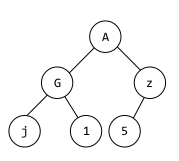
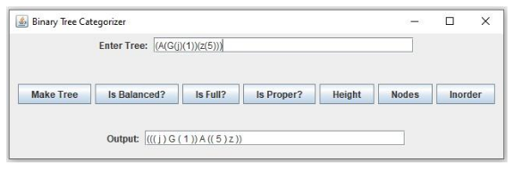

# CMSC 350 Project 3


## Project Description
The third programming project involves writing a program that allows the user to enter a binary tree in a
parenthesized prefix format and then allows it to be categorized and allows various features of that tree to be
displayed. An example of a tree written in the input format is the following:

(A(G(j)(1))(z(5)))

In the above example, data in each node of the tree contains a single alphanumeric character. No spaces are
permitted. Each tree is enclosed in parentheses. Inside those parentheses, after the single character are either
zero, one or two subtrees also enclosed in parentheses. When only one subtree is present, it is the left subtree
and when two are present, they represent the left and right subtrees. So the above string represents the following
binary tree:



## Classes

### Main 

- Creates a GUI that allows the user to input a tree in the above described format.
- Proceeds to construct the tree once the Make Tree button is clicked.
- GUI should look as follows:



### BinaryTree

- Contains a static nested class to define the nodes of the binary tree.
- Constructor called when the Make Tree button is clicked and is supplied a string representation of 
    the tree, then proceeds to construct an actual tree from the string.
- Contains public methods when each of the remaining six buttons are clicked.
- All of these public methods should have corresponding private methods that accomplish their tasks through recursion.

#### public isBalanced method

- Whether the binary tree is balanced, which means for each node in the tree, the absolute difference
  between the height of its left and right subtrees is at most 1. The above binary tree is balanced.

#### private isBalanced method 

#### public isFull method

- Whether the binary tree is full. A full binary tree has the maximum number of nodes for a tree of its
  height. The above tree is not full because a tree of that height can contain 7 nodes, but the above tree
  only has 6.

#### private isFull method

#### public isProper method

- Whether the binary tree is proper. In a proper binary tree, every node has either 0 or 2 children. The
  above tree is not proper because the node containing z has only one child.

#### private isProper method

#### public height method

- The height of the tree. The height of a tree is the maximum level of all of its nodes. The root node
  containing A is at the level 0. Because all three leaf nodes in the above tree are at level 2, its height is 2.

#### private height method

#### public nodes method

- The number of nodes in the tree. As previously mentioned, the above tree has 6 nodes.

#### private nodes method

```text
    // if the parent has no children return 0
    if (node == null) {
      return 0;
    // if the children are leaf nodes return 1
    } else if ((node.left == null) && (node.right == null)) {
      return 1;
    // recursively travel down the tree
    } else {
      return 1 + nodes(node.left) + nodes(node.right);
    } // end if/else if/ else statement
```

#### public inorder method

- A fully parenthesized inorder traversal of the tree. The following should be displayed as the inorder
      traversal of the above tree: ((( j ) G ( 1 )) A (( 5 ) z ))

#### private inorder method

### InvalidTreeSyntax

- Defines a checked exception.
- Should be thrown when an invalid string is supplied and the Make Tree button is clicked.
- This exception should be caught in the main class and a JOptionPane window should be displayed that
    describes the reason for the invalid syntax. 
